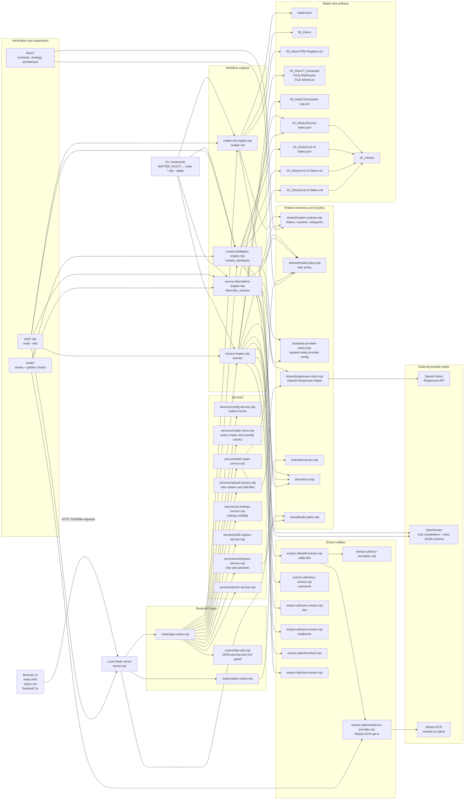
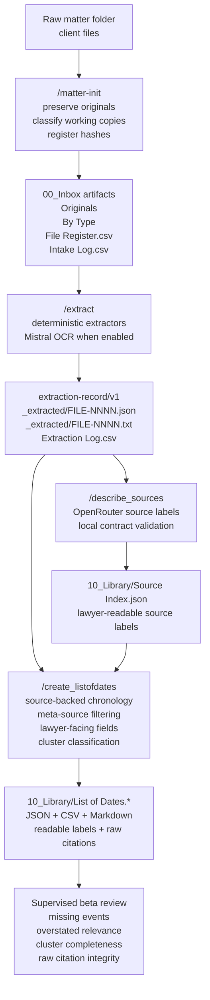
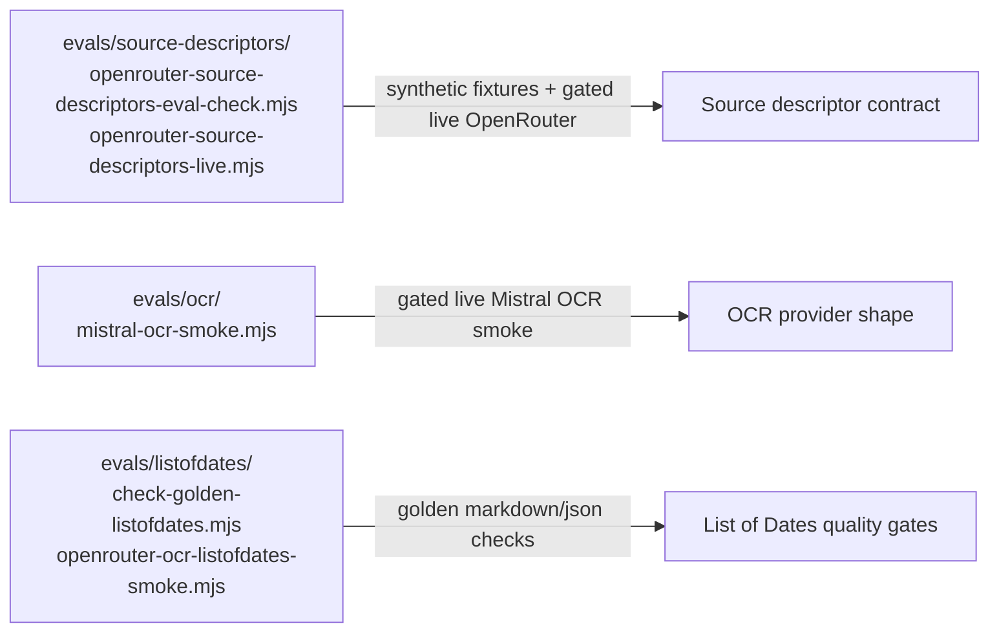

# Matter Workbench Codebase Diagram

This document maps the current Matter Workbench architecture as it exists in this repo. It is a maintenance artifact, not a roadmap. Keep future Unibox/v2 ideas out unless they are clearly marked as future work.

Read the main diagram from left to right: the browser and CLI send actions into the local Node server or workflow engines, the engines use shared contracts and provider policies, and the result is written back as durable matter artifacts on disk.

## Maintenance Rule

Update this diagram when adding a new route, service, engine, persistent artifact, provider path, or major lifecycle stage.

## Runtime System Map



## Matter Lifecycle Map



## Eval And Smoke Tooling

These are not normal runtime routes. They are repo tools for checking provider behavior and artifact quality.



## Current Provider Posture

- `/extract` is deterministic by default. Mistral OCR is opt-in through `MISTRAL_OCR_ENABLED=1`.
- `/describe_sources` is implemented by `source-descriptors-engine.mjs` and uses OpenRouter with strict structured output and local validation.
- `/create_listofdates` uses OpenAI direct by default, or OpenRouter when `SOURCE_BACKED_ANALYSIS_PROVIDER=openrouter`.
- OpenRouter routing remains explicit. Automatic fallback is not enabled for lawyer-facing artifacts.
- Provider output is treated as untrusted until it passes local validation.

At this repo state, `source-descriptors-engine.mjs` is shown as an operational engine path rather than a `routes/api-routes.mjs` endpoint.

## Current Beta Posture

The pipeline is beta-ready for supervised use:

```text
/extract -> /describe_sources -> /create_listofdates
```

The generated List of Dates should be reviewed by a lawyer. The target status is lawyer-review-ready, not court-ready without review.

During beta, reviewers should pay special attention to:

- missing legally important events;
- overstated legal relevance;
- duplicate rows that should have clustered;
- clusters that merged unrelated events;
- missing supporting sources inside a cluster;
- broken raw `FILE-NNNN pX.bY` citations;
- weak source labels;
- OCR quality on scanned PDFs.
