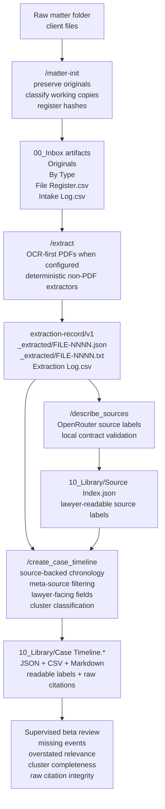
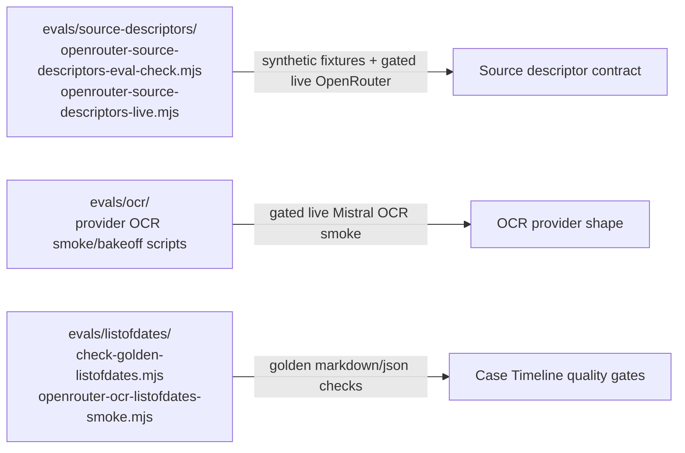

# Matter Workbench Codebase Diagram

This document maps the current Matter Workbench architecture as it exists in this repo. It is a maintenance artifact, not a roadmap. Keep future Unibox/v2 ideas out unless they are clearly marked as future work.

Read the main diagram from left to right: the browser and CLI send actions into
the local Node server or workflow engines, the engines use shared contracts and
provider policies, and the result is written back as durable matter artifacts.
In ordinary local mode those artifacts live on disk. In explicit runtime DB
storage mode, Postgres owns matter identity, payload custody, read surfaces, and
DB-native workflow writes.

## Maintenance Rule

Update this diagram when adding a new route, service, engine, persistent artifact, provider path, or major lifecycle stage.

The matter folder tree is a custody/path identity surface. It displays canonical folder names as-is: `00_Inbox`, `10_Library`, `20_Workshop`, `30_Drafts`, and `40_Dispatch`. Do not document or reintroduce a folder-tree alias layer here.

## Runtime System Map


```mermaid
flowchart LR
  Browser["Browser UI<br/>React-only shell<br/>react-ui/* -> react-dist/"]
  Server["Local Node server<br/>server.mjs"]
  Cli["CLI commands<br/>MATTER_ROOT=... node *.mjs --apply"]

  Browser -->|"HTTP JSON/file requests"| Server

  subgraph FrontendControllers["Frontend surface and temporary helper inventory"]
    ReactApp["react-ui/src/App.tsx<br/>default shell composition"]
    ReactContext["react-ui/src/store/AppContext.tsx<br/>active matter and workspace refresh owner"]
    ReactCommand["react-ui/src/components/command/CommandPanel.tsx<br/>command panel"]
    ReactWorkflowViews["react-ui/src/views/workflows/*.tsx<br/>native workflow views"]
    ReactWorkspaceTree["react-ui/src/components/workspace/WorkspaceTree.tsx<br/>canonical folder tree display"]
    ReactFilePreview["react-ui/src/lib/filePreview.ts<br/>file loading and Case Timeline preview helpers"]
    LegacyHelpers["frontend/*.js<br/>retired UX plus temporary tested helpers"]
  end

  Browser --> ReactApp
  ReactApp --> ReactContext
  ReactApp --> ReactCommand
  ReactApp --> ReactWorkflowViews
  ReactApp --> ReactWorkspaceTree
  ReactApp --> ReactFilePreview

  subgraph Routes["Route/API layer"]
    ApiRoutes["routes/api-routes.mjs<br/>top-level API dispatcher"]
    MatterWorkflowRoutes["routes/matter-workflow-routes.mjs<br/>matter engines, status, context"]
    AppShellRoutes["routes/app-shell-routes.mjs<br/>settings, matters, workspace, files"]
    SkillFactoryRoutes["routes/skill-factory-routes.mjs<br/>skills, ideas, samples, custom runs"]
    HttpUtils["routes/http-utils.mjs<br/>JSON parsing and 413 guard"]
    StaticRoutes["routes/static-routes.mjs"]
  end

  Server --> ApiRoutes
  Server --> StaticRoutes
  ApiRoutes --> MatterWorkflowRoutes
  ApiRoutes --> AppShellRoutes
  ApiRoutes --> SkillFactoryRoutes
  ApiRoutes --> HttpUtils
  MatterWorkflowRoutes --> HttpUtils
  AppShellRoutes --> HttpUtils
  SkillFactoryRoutes --> HttpUtils

  subgraph Services["Services"]
    ConfigService["services/config-service.mjs<br/>matters home"]
    MatterStore["services/matter-store.mjs<br/>active matter and overlap checks"]
    WorkspaceService["services/workspace-service.mjs<br/>tree and previews"]
    UploadService["services/upload-service.mjs<br/>new matters and add files"]
    RuntimeDbMatterIndex["services/runtime-db-matter-index.mjs<br/>Postgres matter list and switch"]
    RuntimeDbStorage["services/runtime-db-storage-service.mjs<br/>payload workspace plus upload commit orchestration"]
    RuntimeDbUploadSessions["services/runtime-db-upload-session-store.mjs<br/>upload session and item persistence"]
    RuntimeDbStores["services/runtime-db-*.mjs<br/>skill ideas, samples, custom skills, runs, command log"]
    AiSettingsService["services/ai-settings-service.mjs<br/>settings visibility"]
    CopilotWebResearchService["services/copilot-web-research-service.mjs<br/>planned Research mode gate"]
    CopilotReceiptService["services/copilot-interaction-receipt-service.mjs<br/>Ask/Research improvement receipts"]
    SkillRegistryService["services/skill-registry-service.mjs"]
    SkillRouterService["services/skill-router-service.mjs"]
    SkillIdeasService["services/skill-ideas-service.mjs"]
    SkillSamplesService["services/skill-samples-service.mjs"]
    ConfigurableSkillsService["services/configurable-skills-service.mjs<br/>custom skill lifecycle and run orchestration"]
    ConfigurableSkillHelpers["services/configurable-skill-*.mjs<br/>definition, store, providers, context, validation"]
    DoctorService["services/doctor-service.mjs"]
  end

  AppShellRoutes --> ConfigService
  AppShellRoutes --> MatterStore
  AppShellRoutes --> WorkspaceService
  AppShellRoutes --> UploadService
  AppShellRoutes --> RuntimeDbMatterIndex
  AppShellRoutes --> RuntimeDbStorage
  RuntimeDbStorage --> RuntimeDbUploadSessions
  AppShellRoutes --> AiSettingsService
  MatterWorkflowRoutes --> CopilotWebResearchService
  AppShellRoutes --> CopilotWebResearchService
  MatterWorkflowRoutes --> CopilotReceiptService
  AppShellRoutes --> CopilotReceiptService
  SkillFactoryRoutes --> SkillRegistryService
  SkillFactoryRoutes --> SkillRouterService
  SkillFactoryRoutes --> SkillIdeasService
  SkillFactoryRoutes --> SkillSamplesService
  SkillFactoryRoutes --> ConfigurableSkillsService
  SkillFactoryRoutes --> RuntimeDbStores
  ConfigurableSkillsService --> ConfigurableSkillHelpers
  MatterWorkflowRoutes --> DoctorService

  subgraph Engines["Workflow engines"]
    MatterInit["matter-init-engine.mjs<br/>/matter-init"]
    Extract["extract-engine.mjs<br/>/extract"]
    SourceDescriptors["source-descriptors-engine.mjs<br/>/describe_sources"]
    ListOfDates["create-listofdates-engine.mjs<br/>/create_case_timeline"]
  end

  MatterWorkflowRoutes --> MatterInit
  MatterWorkflowRoutes --> Extract
  MatterWorkflowRoutes --> SourceDescriptors
  MatterWorkflowRoutes --> ListOfDates
  Cli --> MatterInit
  Cli --> Extract
  Cli --> SourceDescriptors
  Cli --> ListOfDates

  subgraph ExtractUtils["Extract utilities"]
    PdfExtract["extract-utils/pdf-extract.mjs<br/>pdfjs-dist"]
    DocxExtract["extract-utils/docx-extract.mjs<br/>mammoth"]
    XlsxExtract["extract-utils/xlsx-extract.mjs<br/>xlsx"]
    EmlExtract["extract-utils/eml-extract.mjs<br/>mailparser"]
    RtfExtract["extract-utils/rtf-extract.mjs"]
    TextExtract["extract-utils/text-extract.mjs"]
    OcrNormalize["extract-utils/ocr-normalize.mjs"]
    ChainedOcr["extract-utils/chained-ocr-provider.mjs<br/>Mistral primary + Gemini repair"]
    MistralOcr["extract-utils/mistral-ocr-provider.mjs<br/>Mistral OCR primary"]
    GeminiOcr["extract-utils/gemini-ocr-provider.mjs<br/>Gemini OCR repair"]
  end

  Extract --> PdfExtract
  Extract --> DocxExtract
  Extract --> XlsxExtract
  Extract --> EmlExtract
  Extract --> RtfExtract
  Extract --> TextExtract
  PdfExtract --> OcrNormalize
  PdfExtract --> ChainedOcr
  ChainedOcr --> MistralOcr
  ChainedOcr --> GeminiOcr

  subgraph Shared["Shared contracts and AI policy"]
    MatterContract["shared/matter-contract.mjs<br/>folders, headers, categories"]
    WorkspaceLanes["shared/workspace-lanes.mjs<br/>canonical workspace lane names"]
    ArtifactVisibility["docs/contracts/artifact-visibility-and-dispatch.md<br/>folder tree shows canonical names"]
    ModelPolicy["shared/model-policy.mjs<br/>task policy"]
    ProviderPolicy["shared/ai-provider-policy.mjs<br/>request-ready provider config"]
    ResponsesClient["shared/responses-client.mjs<br/>OpenAI Responses helper"]
    LocalEnv["shared/local-env.mjs"]
    Csv["shared/csv.mjs"]
    SafePaths["shared/safe-paths.mjs"]
  end

  MatterInit --> MatterContract
  Extract --> MatterContract
  ReactWorkspaceTree --> WorkspaceLanes
  ReactWorkspaceTree --> ArtifactVisibility
  ListOfDates --> ModelPolicy
  ListOfDates --> ProviderPolicy
  ListOfDates --> ResponsesClient
  SourceDescriptors --> ModelPolicy
  SourceDescriptors --> ProviderPolicy
  SkillRouterService --> ModelPolicy
  SkillRouterService --> ResponsesClient
  Server --> LocalEnv
  MatterInit --> Csv
  Extract --> Csv
  ListOfDates --> Csv
  StaticRoutes --> SafePaths
  WorkspaceService --> SafePaths

  subgraph Providers["External provider paths"]
    OpenAI["OpenAI direct<br/>Responses API"]
    OpenRouter["OpenRouter<br/>chat completions + strict JSON schema"]
    Mistral["Mistral OCR<br/>mistral-ocr-latest"]
    Gemini["Google Gemini<br/>OCR repair"]
  end

  ResponsesClient --> OpenAI
  SourceDescriptors --> OpenRouter
  ListOfDates --> OpenRouter
  MistralOcr --> Mistral
  GeminiOcr --> Gemini

  subgraph Disk["Matter artifacts in filesystem mode"]
    MatterJson["matter.json"]
    FolderTreeRule["Folder tree display<br/>canonical names only<br/>no aliases"]
    Inbox["00_Inbox/"]
    FileRegister["00_Inbox/*/File Register.csv"]
    Extracted["00_Inbox/*/_extracted/<br/>FILE-NNNN.json<br/>FILE-NNNN.txt"]
    ExtractionLog["00_Inbox/*/Extraction Log.csv"]
    Library["10_Library/"]
    SourceIndex["10_Library/Source Index.json"]
    LodJson["10_Library/Case Timeline.json"]
    LodCsv["10_Library/Case Timeline.csv"]
    LodMd["10_Library/Case Timeline.md"]
    Workshop["20_Workshop/"]
    Drafts["30_Drafts/"]
    Dispatch["40_Dispatch/"]
  end

  ReactWorkspaceTree --> FolderTreeRule
  FolderTreeRule --> Inbox
  FolderTreeRule --> Library
  FolderTreeRule --> Workshop
  FolderTreeRule --> Drafts
  FolderTreeRule --> Dispatch
  MatterInit --> MatterJson
  MatterInit --> Inbox
  MatterInit --> Library
  MatterInit --> Workshop
  MatterInit --> Drafts
  MatterInit --> Dispatch
  MatterInit --> FileRegister
  Extract --> Extracted
  Extract --> ExtractionLog
  SourceDescriptors --> SourceIndex
  ListOfDates --> SourceIndex
  ListOfDates --> LodJson
  ListOfDates --> LodCsv
  ListOfDates --> LodMd
  SourceIndex --> Library
  LodJson --> Library
  LodCsv --> Library
  LodMd --> Library

  subgraph AppStores["App-level local stores"]
    SkillIdeasJson["skill-ideas.json<br/>saved skill requests"]
    SkillSamplesJson["skill-samples.json<br/>sample versions and approvals"]
    ConfigurableSkillsJson["configurable-skills.json<br/>custom skill definitions"]
    SkillRunsJson["configurable-skill-runs.json<br/>custom skill run ledger"]
  end

  SkillIdeasService --> SkillIdeasJson
  SkillSamplesService --> SkillSamplesJson
  ConfigurableSkillHelpers --> ConfigurableSkillsJson
  ConfigurableSkillsService --> SkillRunsJson

  subgraph RuntimeDb["Runtime DB storage mode"]
    Postgres["Postgres<br/>tenant-scoped matters, documents, artifacts, skills, receipts"]
    Payloads["storage_object_payloads<br/>source/artifact/sample bytes"]
    MaterializedScratch["temporary materialized matter folder<br/>scratch only"]
  end

  RuntimeDbMatterIndex --> Postgres
  RuntimeDbStorage --> Postgres
  RuntimeDbStorage --> Payloads
  RuntimeDbStores --> Postgres
  MatterWorkflowRoutes --> RuntimeDbStorage
  RuntimeDbStorage --> MaterializedScratch
  MaterializedScratch --> MatterInit
  MaterializedScratch --> Extract
  MaterializedScratch --> SourceDescriptors
  MaterializedScratch --> ListOfDates

  subgraph Verification["Verification and supervision"]
    Tests["test/*.mjs<br/>node --test"]
    Evals["evals/*<br/>smoke + golden checks"]
    Docs["docs/*<br/>contracts, strategy, architecture"]
  end

  Tests --> Server
  Tests --> MatterInit
  Tests --> Extract
  Tests --> SourceDescriptors
  Tests --> ListOfDates
  Evals --> SourceDescriptors
  Evals --> MistralOcr
  Evals --> ListOfDates
  Docs --> MatterContract
  Docs --> ModelPolicy
```

## Matter Lifecycle Map


```mermaid
flowchart TD
  RawMatter["Raw matter folder<br/>client files"]
  MatterInit["/matter-init<br/>preserve originals<br/>classify working copies<br/>register hashes"]
  InboxArtifacts["00_Inbox artifacts<br/>Originals<br/>By Type<br/>File Register.csv<br/>Intake Log.csv"]
  Extract["/extract<br/>OCR-first PDFs when configured<br/>deterministic non-PDF extractors"]
  ExtractionRecords["extraction-record/v1<br/>_extracted/FILE-NNNN.json<br/>_extracted/FILE-NNNN.txt<br/>Extraction Log.csv"]
  DescribeSources["/describe_sources<br/>OpenRouter source labels<br/>local contract validation"]
  SourceIndex["10_Library/Source Index.json<br/>lawyer-readable source labels"]
  CreateListOfDates["/create_case_timeline<br/>source-backed chronology<br/>meta-source filtering<br/>lawyer-facing fields<br/>cluster classification"]
  ListOfDates["10_Library/Case Timeline.*<br/>JSON + CSV + Markdown<br/>readable labels + raw citations"]
  BetaReview["Supervised beta review<br/>missing events<br/>overstated relevance<br/>cluster completeness<br/>raw citation integrity"]

  RawMatter --> MatterInit
  MatterInit --> InboxArtifacts
  InboxArtifacts --> Extract
  Extract --> ExtractionRecords
  ExtractionRecords --> DescribeSources
  DescribeSources --> SourceIndex
  ExtractionRecords --> CreateListOfDates
  SourceIndex --> CreateListOfDates
  CreateListOfDates --> ListOfDates
  ListOfDates --> BetaReview
```

## Eval And Smoke Tooling

These are not normal runtime routes. They are repo tools for checking provider behavior and artifact quality.


```mermaid
flowchart LR
  SourceEval["evals/source-descriptors/<br/>openrouter-source-descriptors-eval-check.mjs<br/>openrouter-source-descriptors-live.mjs"]
  OcrSmoke["evals/ocr/<br/>provider OCR smoke/bakeoff scripts"]
  LodEval["evals/listofdates/<br/>check-golden-listofdates.mjs<br/>openrouter-ocr-listofdates-smoke.mjs"]

  SourceEval -->|"synthetic fixtures + gated live OpenRouter"| SourceContract["Source descriptor contract"]
  OcrSmoke -->|"gated live Mistral OCR smoke"| OcrContract["OCR provider shape"]
  LodEval -->|"golden markdown/json checks"| LodContract["Case Timeline quality gates"]
```

## Developer Attention Surface

Matter-level blocker and warning inspection is intentionally read-only:

- API: `GET /api/matter-attention`
- named inspection without active-matter switching: `GET /api/matter-attention?matter=...`
- CLI sweep: `npm run matter-attention:report -- --only-problems`
- UI: active matter overview renders a compact Developer attention card from the same API

The implementation lives in:

- `react-ui/src/views/MatterOverview.tsx` - default React overview surface that renders blocker/warning counts and bounded evidence-backed items.
- `frontend/views/matter-attention-card.js` - legacy overview card renderer for the same matter-attention API.
- `services/matter-attention-service.mjs` - orchestration, item normalization, sorting, summary.
- `services/matter-attention-intake.mjs` - matter setup, file register, working-copy, extraction-log, OCR-placeholder, and skipped-file signals.
- `services/matter-attention-source-labels.mjs` - Source Index existence/schema/label-review/developer-name and Source Labels rerun-advice signals.
- `services/matter-attention-chronology.mjs` - Case Timeline JSON/Markdown and chronology dependency-state signals.
- `services/matter-attention-custom-runs.mjs` - custom skill run failure and ledger warning signals.
- `services/matter-attention-command-failures.mjs` - recent command failure signals through the command log service boundary.
- `services/matter-attention-rerun-advice.mjs` - shared rerun-advice-to-attention-item mapping.
- `services/matter-attention-items.mjs` - stable item ids, sorting, and summary counts.
- `services/command-interaction-log-service.mjs`
- `scripts/matter-attention-report.mjs`
- `docs/future-design-decisions/matter-developer-attention-surface.md`
- `docs/future-design-decisions/system-health-surface.md` - parked future app-wide health surface, separate from matter-level attention.

## Current Provider Posture

- `/extract` uses OCR-first PDF extraction when `MISTRAL_API_KEY` is configured. Mistral is the primary OCR provider; Gemini can be used as repair when configured and quality doubt is detected. PDF.js remains available for page-count, text-layer diagnostics, and fallback.
- `/describe_sources` is implemented by `source-descriptors-engine.mjs` and uses OpenRouter with strict structured output and local validation.
- `/create_case_timeline` uses OpenAI direct by default, or OpenRouter when `SOURCE_BACKED_ANALYSIS_PROVIDER=openrouter`.
- OpenRouter routing remains explicit. Automatic fallback is not enabled for lawyer-facing artifacts.
- Provider output is treated as untrusted until it passes local validation.

At this repo state, `source-descriptors-engine.mjs` is both:

- a runtime endpoint path via `POST /api/describe-sources` through `routes/matter-workflow-routes.mjs`; and
- a direct CLI engine path for scripted local runs.

## Current Beta Posture

The pipeline is beta-ready for supervised use:

```text
/extract -> /describe_sources -> /create_case_timeline
```

The generated Case Timeline should be reviewed by a lawyer. The target status is lawyer-review-ready, not court-ready without review.

During beta, reviewers should pay special attention to:

- missing legally important events;
- overstated legal relevance;
- duplicate rows that should have clustered;
- clusters that merged unrelated events;
- missing supporting sources inside a cluster;
- broken raw `FILE-NNNN pX.bY` citations;
- weak source labels;
- OCR quality on scanned PDFs.

## Runtime DB Posture

Filesystem mode remains the default local beta path. Runtime DB storage mode is
explicit:

```text
MWB_RUNTIME_DB=postgres
MWB_RUNTIME_DB_STORAGE=postgres
MWB_DB_RUNTIME_CUTOVER_APPROVED=yes
MWB_RUNTIME_DATABASE_URL=<normal runtime role>
```

In that mode, Postgres is the source for matter listing/switching, workspace
trees, file previews, raw file payloads, status, prepare/advisory reads, skill
factory state, custom-skill run receipts, command interaction history, uploads,
and foreground DB-native workflow writes. Runtime routes fail closed if required
DB custody helpers are missing; hosted DB-claimed workers remain future work.
